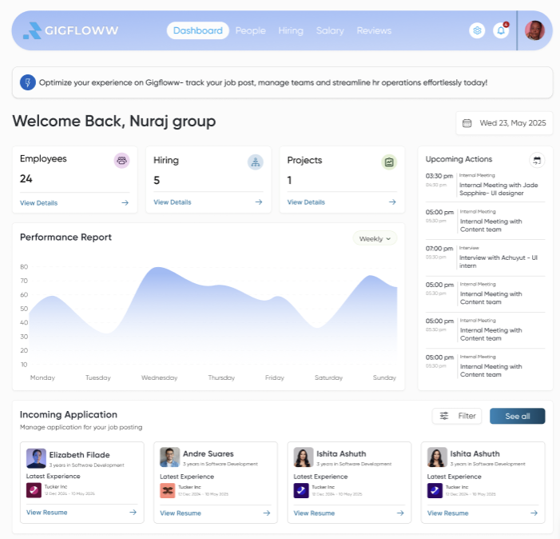

# GigFlow Dashboard 

A modern HR management dashboard built with React, TypeScript, and Tailwind CSS, featuring the elegant Shadcn UI component library.

This dashboard was built for GigFloww — a next-generation HR consultancy helping businesses in the US and UK optimize their workforce by replacing traditional employees with skilled interns and entry-level professionals. The platform supports cost-effective hiring, streamlined onboarding, flexible team scaling, and efficient workforce tracking — all without long-term commitments.

**Live Demo**: https://gig-floww-dashboard.vercel.app/

---
## 📸 Preview

<p align="center">
  
</p>

## ✨ Features

- **Performance Analytics** - Real-time performance tracking with interactive charts
- **Team Management** - Comprehensive employee and hiring oversight
- **Project Tracking** - Monitor ongoing projects and upcoming actions
- **Application Management** - Streamlined job application processing
- **Schedule Integration** - Meeting and event scheduling system
- **Modern UI/UX** - Clean, responsive design with Shadcn UI components
- **Mobile Responsive** - Optimized for all devices and screen sizes

## 🛠️ Tech Stack

- **Frontend**: React 18+ with TypeScript
- **Styling**: Tailwind CSS
- **UI Components**: Shadcn UI
- **Build Tool**: Vite
- **Package Manager**: npm/yarn
- **Configuration**: ESLint, Prettier

## 🚀 Quick Start

### Prerequisites

- Node.js 16+ and npm/yarn
- Git

### Installation

1. **Clone the repository**

   ```bash
   git clone https://github.com/Anish-Tripathi/GigFloww-Dashboard
   cd gigflow-dashboard
   ```

2. **Install dependencies**

   ```bash
   npm install
   # or
   yarn install
   ```

3. **Start the development server**

   ```bash
   npm run dev
   # or
   yarn dev
   ```

4. **Open your browser**
   ```
   http://localhost:5173
   ```

## 📁 Project Structure

```
gigflow-dashboard/
├── public/
│   └── index.html
├── src/
│   ├── components/
│   ├── lib/
│   │   └── utils.ts      # Utility functions
│   ├── screens/
│   │   └── GigflowwDashboard/
│   │       ├── sections/
│   │       │   ├── DashboardSection.tsx
│   │       │   ├── HeaderSection.tsx
│   │       │   ├── IncomingApplicationsSection.tsx
│   │       │   ├── PerformanceReportSection.tsx
│   │       │   ├── UpcomingActionsSection.tsx
│   │       │   └── WelcomeSection.tsx
│   │       ├── GigflowwDashboard.tsx
│   │       └── index.ts
│   └── index.tsx
├── package.json
├── package-lock.json
├── tailwind.config.js
├── tsconfig.json
└── README.md
```

## 🎨 Available Scripts

- `npm run dev` - Start development server
- `npm run build` - Build for production
- `npm run preview` - Preview production build
- `npm run lint` - Run ESLint
- `npm run type-check` - Run TypeScript checks

## 📦 Key Dependencies

```json
{
  "react": "^18.2.0",
  "typescript": "^5.0.0",
  "tailwindcss": "^3.3.0",
  "@radix-ui/react-*": "Various Shadcn UI components",
  "lucide-react": "^0.263.1",
  "recharts": "^2.8.0"
}
```

## 🔧 Configuration

### Tailwind CSS

The project uses a custom Tailwind configuration with Shadcn UI integration:

```javascript
// tailwind.config.js
module.exports = {
  content: ["./src/**/*.{ts,tsx}"],
  theme: {
    extend: {
      // Custom theme extensions
    },
  },
};
```

### TypeScript

Strict TypeScript configuration for better code quality:

```json
// tsconfig.json
{
  "compilerOptions": {
    "strict": true,
    "target": "ES2020",
    "module": "ESNext"
  }
}
```

## 🎯 Dashboard Features

### Performance Metrics

- Weekly performance tracking
- Interactive data visualization
- Real-time analytics updates

### Team Management

- Employee directory (24 employees)
- Hiring pipeline (5 positions)
- Project oversight (1 active project)

### Application Processing

- Resume management system
- Candidate evaluation tools
- Interview scheduling

## 🎯 Component Architecture

The dashboard is built with a modular section-based architecture:

- **HeaderSection** - Navigation and user profile
- **WelcomeSection** - Welcome message and date display
- **DashboardSection** - Main metrics overview (employees, hiring, projects)
- **PerformanceReportSection** - Interactive performance charts
- **UpcomingActionsSection** - Scheduled meetings and events
- **IncomingApplicationsSection** - Job application management
